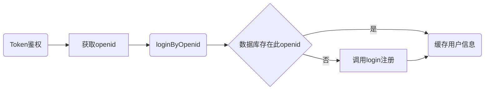

# 失物招领小程序后端
[TOC]   

## 1.服务介绍   

* [x] 用户服务[user](#user)   
* [x] 物品服务[item](#item)    
* [x] 上传服务[upload](#upload)

##  2.部署流程

### 2.1 安装依赖

```shell
pip install -r requirements.txt
apt install nginx uwsgi mysql-server
```

### 2.2 选择数据库

#### 2.2.1 MySQL 数据库: 

在LostAndFound/settings.py文件中<u>**注释掉**</u>

```python
DATABASES = {
    'default': {
        'ENGINE': 'django.db.backends.sqlite3',
        'NAME': os.path.join(BASE_DIR, 'db.sqlite3'),
    }
}
```

在LostAndFound/settings.py文件中<u>**取消以下内容的注释**</u>

```python
DATABASES = {
    'default': {
        'ENGINE': 'django.db.backends.mysql',
        'NAME': 'lostandfound',
        'USER': '',
        'PASSWORD': '',
        'HOST': '127.0.0.1',
        'PORT': '3306',
        'OPTIONS': {'charset': 'utf8mb4'},
    }
}
```

在LostAndFound/settings.py 文件夹中填写数据库的地址、用户名和密码。


设置mysql utf-8编码   

>输入下面的命令，打开第一个配置文件
>```
>vim /etc/mysql/conf.d/mysql.cnf
>```
>在 [mysql] 标签的下一行添加下面的配置
>```
>default-character-set=utf8
>```
>输入下面的命令，打开第二个配置文件
>```
>vim /etc/mysql/mysql.conf.d/mysqld.cnf
>```
>找到 [mysqld] 标签，在其下一行添加下面的配置
>```
>character-set-server=utf8
>```
>配置文件修改成功之后，输入下面的命令重启mysql服务
>```
>service mysql restart
>```
>重启之后再去查看数据库的默认编码方式
>```
>show variables like '%character%';
>```
>
>```
>mysql> show variables like '%character%';
>+--------------------------+----------------------------+
>| Variable_name            | Value                      |
>+--------------------------+----------------------------+
>| character_set_client     | utf8                       |
>| character_set_connection | utf8                       |
>| character_set_database   | utf8                       |
>| character_set_filesystem | binary                     |
>| character_set_results    | utf8                       |
>| character_set_server     | utf8                       |
>| character_set_system     | utf8                       |
>| character_sets_dir       | /usr/share/mysql/charsets/ |
>+--------------------------+----------------------------+
>```
创建数据库并设置数据库编码

```mysql
CREATE DATABASE lostandfound DEFAULT CHARSET utf8 COLLATE utf8_general_ci;
```

#### 2.2.2 SQLite数据库

**默认选择的是这种数据库，不需要更改**

在LostAndFound/settings.py文件中<u>**注释掉**</u>

```python
DATABASES = {
    'default': {
        'ENGINE': 'django.db.backends.mysql',
        'NAME': 'lostandfound',
        'USER': '',
        'PASSWORD': '',
        'HOST': '127.0.0.1',
        'PORT': '3306',
        'OPTIONS': {'charset': 'utf8mb4'},
    }
}
```

在LostAndFound/settings.py文件中<u>**取消以下内容的注释**</u>

```python
DATABASES = {
    'default': {
        'ENGINE': 'django.db.backends.sqlite3',
        'NAME': os.path.join(BASE_DIR, 'db.sqlite3'),
    }
}
```

### 2.3 设置默认路径

在LostAndFound/settings.py文件中，设置媒体文件media/的位置、静态文件static/的位置

### 2.4 运行服务

将models的改动同步到数据库   

```shell script
python manage.py makemigrations user
python manage.py makemigrations item
python manage.py migrate
```
运行调试(仅调试，上线请勿用此方法)
```shell script
python manage.py runserver
```

## 3.上线流程

需要Nginx，uwsgi支持

### MySQL

创建数据库并设置数据库编码
```mysql
CREATE DATABASE lostandfound DEFAULT CHARSET utf8 COLLATE utf8_general_ci;
```

在LostAndFound/settings.py 文件夹中填写数据库的用户名和密码。

### SQLite


### 同步数据库接口

```shell script
python manage.py makemigrations user
python manage.py makemigrations item
python manage.py migrate
```
#### 上线：

在LostAndFound/settings.py 文件夹中填写DOMAIN为服务器地址

```shell script
python manage.py collectstatic
```

#### 关于django admin   
创建超级用户

```shell script
python manage.py createsuperuser
```
访问DOMAIN/admin来管理内容


## <a name = "user">user相关接口文档</a>

* [x] <a href='#login'>login</a>   
* [x] <a href='#getOpenid'>getOpenid</a>   
* [x] <a href='#loginByOpenid'>loginByOpenid</a>   
* [x] <a href='#logout'>logout</a>   
* [x] <a href='#get'>get</a>   
* [x] <a href='#update'>update</a>    

用户交互流程  

**注：用户的openid是所有操作的必须项**

### 数据模型

| 变量名    | 类型   | 变量含义                             |
| --------- | ------ | :----------------------------------- |
| id        | int    | 数据模型内部自增索引。前端无需操作。 |
| openid    | string | 前端获取的用户唯一标识               |
| nick_name | string | 用户昵称                             |
| avatar    | string | 用户头像(url)，一般是微信头像        |
| gender    | int    | 性别，0或1                           |
| phone     | string | 用户联系方式（不一定一定是手机号）   |
| ctime     | string | 数据创建时间（所有model共有的特性）  |
| mtime     | string | 数据修改时间（所有model共有的特性）  |

### Token鉴权

[Token账户鉴权系统][https://gogs.itoken.team/634308664/token-sso/src/master]

请前端同学先调用token账户鉴权系统，鉴权成功后再以流程验证登录。

如果鉴权成功，鉴权时用户输入的手机号可以直接作为login的phone参数进行注册，不需要再验证。




数据库是否存在openid这一过程是依靠返回值判断的。

所有正确操作的返回值都是0

### <a name='login'>login</a> 用户登录（无状态注册）

**如果没有数据库内用户的openid，则用login进行注册**

url = www.example.com/service/user/login   
method = post   
params:   

| 名称      |  类型  | 必须 |                       备注                        |
| --------- | :----: | :--: | :-----------------------------------------------: |
| openid    | string |  是  | 可通过云函数或getOpenid获取，是每个用户的唯一凭证 |
| gender    |  int   |  是  |           1是男还是女由前端自己决定= =            |
| phone     | string |  是  |            手机号，必要时可以短信验证             |
| avatar    | string |  是  |                头像url（微信头像）                |
| nick_name | string |  是  |            用户微信名或用来显示的名字             |

return:

```json
{
    "code": 0,
    "msg": "success",
    "data": {
        "id": 1,
        "openid": "xxxxxxxx",
        "ctime": "2020-03-26 11:34:29",
        "mtime": "2020-03-26 11:34:35",
        "nick_name": "张三",
        "avatar": "http://www.example/media/avatar/1_20200401184953.jpg",
        "gender": "1",
        "phone": "12312312312"
    }
}
```

错误码：

| code |           含义           |
| ---- | :----------------------: |
| -1   |      提交的参数非法      |
| -2   | 其他错误，详情见错误输出 |

### <a name='getOpenid'>getOpenid</a> 获取用户openid   

url = www.example.com/service/user/getOpenid   
method = post   
params:   

*不建议使用*

| 名称    |  类型  | 必须 | 备注 |
| :------ | :----: | :--: | :--: |
| js_code | string |  是  |      |

**建议使用云函数：   **
https://developers.weixin.qq.com/miniprogram/dev/wxcloud/guide/functions/userinfo.html

### <a name='loginByOpenid'>loginByOpenid</a> 通过openid登陆，获取个人信息  

url = www.example.com/service/user/loginByOpenid   
method = post   
params:   

| 名称   |   类型 | 必须 | 备注 |
| :----- | -----: | :--: | :--: |
| openid | string |  是  |      |

return:

```json
{
    "code": 0,
    "msg": "success",
    "data": {
        "id": 1,
        "openid": "xxxxxxxxxxxxxx",
        "ctime": "2020-03-26 11:34:29",
        "mtime": "2020-03-26 11:34:35",
        "nick_name": "张三",
        "avatar": "http://www.example.com/media/avatar/1_20200320184953.jpg",
        "gender": 1,
        "phone": "12312312312"
    }
}
```

错误码：

| code |                含义                 |
| ---- | :---------------------------------: |
| -1   |           提交的参数非法            |
| -2   | 不存在此用户，此时应该调用login方法 |


### <a name='get'>get</a> 获取用户详情   

url = www.example.com/service/user/get   
method = post   
params:   

| 名称   | 类型 | 必须 | 备注 |
| :----- | :--: | :--: | :--: |
| openid | int  |  是  |      |

return:

```json
{
    "code": 0,
    "msg": "success",
    "data": {
        "openid": "xxxxxxxxxxxxxx",
        "ctime": "2020-03-26 11:34:29",
        "mtime": "2020-03-26 11:34:35",
        "nick_name": "张三",
        "avatar": "https://www.example.com/media/avatar/1_20200320184953.jpg",
        "gender": 1,
        "phone": "12312312312"
    }
}
```

错误码：

| code |                    含义                    |
| ---- | :----------------------------------------: |
| -1   |               提交的参数非法               |
| -2   | 返回了多组数据（一个openid对应了多个用户） |
| -3   |          其他错误，详情见错误输出          |
| -4   |                 用户不存在                 |


### <a name='update'>update</a> 更新用户信息   

url = www.example.com/service/user/update   
method = post   
params:   

| 名称    |     类型     | 必须 |                            备注                             |
| :------ | :----------: | :--: | :---------------------------------------------------------: |
| user_id |     int      |  是  |                                                             |
| update  | json(string) |  是  | 如果提交的是字符串格式的json程序会loads，但最好提交json格式 |

e.g.:   
update={"phone":"13333333333"}   

return:   

```json
{
    "code": 0,
    "msg": "success",
    "data": []
}
```

错误码：

| code |                含义                |
| ---- | :--------------------------------: |
| -1   |           提交的参数非法           |
| -2   |      其他错误，详情见错误输出      |
| -3   | update参数提交的不是有效的json格式 |
| -4   |            json处理错误            |


  ## <a name = "item">item相关接口</a>

* [x] <a href='#create'>create</a>   
* [x] <a href='#list'>list</a>   
* [x] <a href='#delete'>delete</a>   
* [x] <a href='#update'>update</a>   
* [x] <a href='#recover'>recover</a>   

请注意！：物品在服务端的唯一标识为id。删除、恢复和更新都需要提供id来进行操作。

错误返回值和含义：

| code | 含义                   |
| ---- | ---------------------- |
| -1   | 提供的参数非法         |
| -2   | 其他错误，详见具体输出 |

### 数据模型

| 变量名    | 类型        | 变量含义                                 |
| --------- | ----------- | :--------------------------------------- |
| id        | int         | 模型内自动生成的自增索引，物品的唯一标识 |
| openid    | string      | 发布者的openid                           |
| type      | int         | 物品属性（1是丢失的，2是找到的）         |
| title     | string      | 用户头像(url)，一般是微信头像            |
| desc      | string      | 物品描述                                 |
| images    | json_string | 物品图片                                 |
| visible   | int         | 是否可见。（用来完成删除和重新发布操作） |
| ctime     | string      | 数据创建时间（所有model共有的特性）      |
| mtime     | string      | 数据修改时间（所有model共有的特性）      |
| user_info | json        | 发布者的个人用户信息                     |

### <a name='create'>create</a> 创建动态   

url = www.example.com/service/item/create   
method = post   
params:   


| 名称   |        类型 | 必须 |                             备注                             |
| :----- | ----------: | :--: | :----------------------------------------------------------: |
| openid |         int |  是  |                  用户标识，用来指明是谁发的                  |
| type   |         int |  是  |                1:丢失了(lost) 2:找到了(found)                |
| desc   |      string |  是  |                           物品描述                           |
| title  |      string |  否  |                物品名称（保留字段，可只传""）                |
| images | json_string |  否  | 建议先调用接口上传图片(upload/itemImg)，成功填此接口；或者先创建，再上传图片，再更新此字段（不建议） |

**返回该物品的信息。物品信息格式化输出时中包含了发布者的信息**

return:

```json
{
    "code": 0,
    "msg": "success",
    "data": [{
                "id": 1,
                "openid": "1321321231",
                "ctime": "2020-03-26 14:55:20",
                "mtime": "2020-03-26 14:55:28",
                "type": 1,
                "title": "",
                "desc": "丢失",
                "images": [],
                "user_info": {
                    "openid": "xxxxxxxx",
        			"ctime": "2020-03-26 11:34:29",
        			"mtime": "2020-03-26 11:34:35",
        			"nick_name": "张三",
        			"avatar": "http://www.example/media/avatar/1_20200401184953.jpg",
			        "gender": "1",
        			"phone": "12312312312"
                }
            }]
}
```

### <a name='list'>list</a> 查询动态列表   

url = www.example.com/service/item/list   
method = post   
params:   

按照传递的不同参数可实现不同功能。如果是广场则传type=1是列出丢失的物品，type=2是列出找到的物品。

添加page和size的原因是控制一次呈现的物品数量，一面一次性返回过多数据。前端可以用“下一页”之类功能来使size+1来达到翻页效果


| 名称    |   类型 | 必须 |                             备注                             |
| :------ | -----: | :--: | :----------------------------------------------------------: |
| id      |    int |  否  |                        以物品id来查询                        |
| openid  |    int |  否  |         以openid来查询（用来查看用户发布的所有消息）         |
| type    |    int |  否  |                 以类型来查询，1丢失的2找到的                 |
| desc    | string |  否  |                           物品描述                           |
| page    |    int |  否  | 显示第几页，如果无参数则默认显示第0页（防止一下载入太多数据） |
| size    |    int |  否  |              每页几个物品，如果无参数则默认10个              |
| title   | string |  否  |                物品名称（保留字段，可只传""）                |
| visible |    int |  否  | 显示可见的或已隐藏的动态。默认值为1，即只显示可见的（未被delete操作的）动态。传0时可用来显示用户删除的动态。 |

**列表返回的物品都是以id降序排序的，也就是指按发布时间降序排序，越新越靠前**

return:

```json
{
    "code": 0,
    "msg": "success",
    "data": {
        "cnt": 2,
        "items": [
            {
                "id": 1,
                "openid": "1321321231",
                "ctime": "2020-03-26 14:55:20",
                "mtime": "2020-03-26 14:55:28",
                "type": 1,
                "title": "",
                "desc": "丢失",
                "images": [],
                "user_info": {
                    "openid": "xxxxxxxx",
        			"ctime": "2020-03-26 11:34:29",
        			"mtime": "2020-03-26 11:34:35",
        			"nick_name": "张三",
        			"avatar": "http://www.example/media/avatar/1_20200401184953.jpg",
			        "gender": "1",
        			"phone": "12312312312"
                }
            },
            {
                "id": 2,
                "openid": "1321321231",
                "ctime": "2020-03-26 16:53:28",
                "mtime": "2020-03-26 16:53:28",
                "type": 1,
                "title": "",
                "desc": "丢失",
                "images": [],
                "user_info": {
                    "openid": "xxxxxxxx",
        			"ctime": "2020-03-26 11:34:29",
        			"mtime": "2020-03-26 11:34:35",
        			"nick_name": "张三",
        			"avatar": "http://www.example/media/avatar/1_20200401184953.jpg",
			        "gender": "1",
        			"phone": "12312312312"
                }
            }
        ]
    }
}
```


### <a name='delete'>delete</a> 删除动态   

url = www.example.com/service/item/delete
method = post   
params:   


| 名称   | 类型 | 必须 |                  备注                  |
| :----- | ---: | :--: | :------------------------------------: |
| id     |  int |  是  |                 动态id                 |
| openid |  int |  是  | 用户openid，用户只能删除自己发布的信息 |

return:

```json
{
    "code": 0,
    "msg": "success",
    "data": []
}
```


### <a name='apply'>update</a> 更新动态   

url = www.example.com/service/item/update   
method = post   
params:   


| 名称   |        类型 | 必须 |                             备注                             |
| :----- | ----------: | :--: | :----------------------------------------------------------: |
| id     |         int |  是  |                           物品的id                           |
| openid |         int |  是  |                                                              |
| type   |         int |  否  |                                                              |
| images | json_string |  否  | 建议先调用接口上传图片(upload/itemImg)，成功填此接口；或者先创建，再上传图片，再更新此字段（不建议） |
| title  |      string |  否  |                物品名称（保留字段，可只传""）                |
| desc   |      string |  否  |                           物品描述                           |

return:

```json
{
    "code": 0,
    "msg": "success",
    "data": []
}
```

### <a name='recover'>recover</a> 恢复动态   

**用于重新发布**

url = www.example.com/service/item/recover  
method = post   
params:   


| 名称   | 类型 | 必须 |                  备注                  |
| :----- | ---: | :--: | :------------------------------------: |
| id     |  int |  是  |                 动态id                 |
| openid |  int |  是  | 用户openid，用户只能恢复自己发布的信息 |

return:

```json
{
    "code": 0,
    "msg": "success",
    "data": []
}
```


### 

## <a name = "upload">upload相关接口</a>

* [x] <a href='#avatar'>avatar</a>   
* [x] <a href='#itemImg'>itemImg</a>  


***如果用户是第一次注册，就先调用avatar方法保存用户头像，并将返回值保存后留等调用login方法时提交，以此来将用户的头像保存在本地加快内容加载速度。***

### <a name='avatar'>avatar</a> 上传用户头像

**这个接口接受一个给定的url，并将指定的图片保存在本地。一般用于呈现用户的微信头像。**

url = www.example.com/service/upload/avatar      
method = post   
params:   

| 名称   |  类型  | 必须 |        备注         |
| :----- | :----: | :--: | :-----------------: |
| openid |  int   |  是  |    用户唯一标识     |
| avatar | string |  是  | 头像url（微信头像） |

return:

```json
{
    "code": 0,
    "msg": "success",
    "data": {
        "avatar": "https://www.example.com/media/avatar/test.jpg"
    }
}
```

错误代码

| code |           含义           |
| ---- | :----------------------: |
| -1   |      提交的参数非法      |
| -2   | 其他错误，详情见错误输出 |


### <a name='itemImg'>itemImg</a> 上传用户头像

**这个接口上传的是图片文件，用来在物品描述也上传图片用。如果用于用户自定义头像，建议还是用avatar方法较好，用用户的微信头像以免上传的头像出现其他问题**

url = www.example.com/service/upload/itemImg      
method = post   
params:   

| 名称   | 类型 | 必须 |                    备注                     |
| :----- | :--: | :--: | :-----------------------------------------: |
| images | file |  是  | 可传多个、要将input标签中的name设置为images |

return:

```json
{
    "code": 0,
    "msg": "success",
    "data": "[\"https://www.example.com/media/item/2020/3/27/011216_59730.jpg\", \"https://www.example.com/media/item/2020/3/27/011216_89864.jpg\"]"
}
```

| code |             含义             |
| ---- | :--------------------------: |
| -1   | 提交的参数非法或文件不是图片 |
| -2   |   其他错误，详情见错误输出   |
