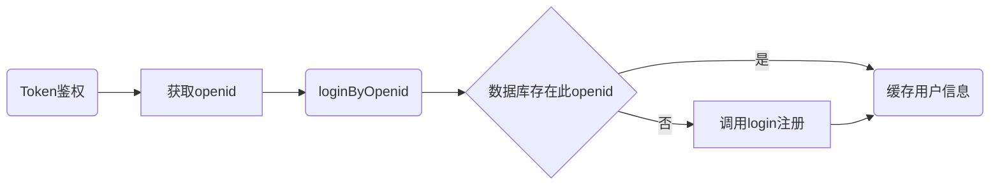

## <a name = "user">user相关接口文档</a>

* [x] <a href='#login'>login</a>   
* [x] <a href='#getOpenid'>getOpenid</a>   
* [x] <a href='#loginByOpenid'>loginByOpenid</a>   
* [x] <a href='#get'>get</a>   
* [x] <a href='#update'>update</a>    
* [x] <a href='#addHistory'>addHistory</a>    
* [x] <a href='#getHistory'>getHistory</a>    
* [x] <a href='#cleanHistory'>cleanHistory</a>    

用户交互流程  

**注：用户的openid是所有操作的必须项**

### 数据模型

| 变量名      | 类型   | 变量含义                             |
| ----------- | ------ | :----------------------------------- |
| id          | int    | 数据模型内部自增索引。前端无需操作。 |
| openid      | string | 前端获取的用户唯一标识               |
| qq        | string | qq                             |
| phone       | string | 用户手机号                           |
| cardno      | string | 用户的学号                           |
| wxid        | string | 用户微信号                           |
| created_at  | string | 数据创建时间（所有model共有的特性）  |
| modified_at | string | 数据修改时间（所有model共有的特性）  |

### Token鉴权

[Token账户鉴权系统][https://gogs.itoken.team/634308664/token-sso/src/master]

请前端同学先调用token账户鉴权系统，鉴权成功后再以流程验证登录。

**鉴权成功后，鉴权返回的手机号、姓名、学号可以直接作为login的参数进行注册。**




数据库是否存在openid这一过程是依靠返回值判断的。

所有正确操作的返回值都是0

### <a name='login'>login</a> 用户登录（无状态注册）

**如果没有数据库内用户的openid，则用login进行注册**

url = www.example.com/service/user/login   
method = post   
params:   

| 名称   |  类型  | 必须 |                       备注                        |
| ------ | :----: | :--: | :-----------------------------------------------: |
| openid | string |  是  | 可通过云函数或getOpenid获取，是每个用户的唯一凭证 |
| phone  | string |  是  |                      手机号                       |
| qq   | string |  是  |                     qq                      |
| cardno | string |  是  |                    用户的学号                     |
| wxid   | string |  否  |      （可选）用户的其他联系方式，如QQ/微信等      |

return:

```json
{
    "code": 0,
    "msg": "success",
    "data": {
        "id": 1,
        "openid": "xxxxxxxx",
        "phone": "12345678912",
        "qq": "张三",
        "cardno": "0111111111111",
        "wxid": "weixin_id123",
        "created_at": "2020-03-26 11:34:29",
        "modified_at": "2020-03-26 11:34:35"
    }
}
```

错误码：

| code |           含义           |
| ---- | :----------------------: |
| -1   |      提交的参数非法      |
| -2   | 其他错误，详情见错误输出 |

### <a name='getOpenid'>getOpenid</a> 获取用户openid   

url = www.example.com/service/user/getOpenid   
method = post   
params:   

*不建议使用*

| 名称    |  类型  | 必须 | 备注 |
| :------ | :----: | :--: | :--: |
| js_code | string |  是  |      |

**建议使用云函数：   **
https://developers.weixin.qq.com/miniprogram/dev/wxcloud/guide/functions/userinfo.html

### <a name='loginByOpenid'>loginByOpenid</a> 通过openid登陆，获取个人信息  

url = www.example.com/service/user/loginByOpenid   
method = post   
params:   

| 名称   |   类型 | 必须 | 备注 |
| :----- | -----: | :--: | :--: |
| openid | string |  是  |      |

return:

```json
{
    "code": 0,
    "msg": "success",
    "data": {
        "id": 1,
        "openid": "xxxxxxxx",
        "phone": "12345678912",
        "qq": "张三",
        "cardno": "0111111111111",
        "wxid": "weixin_id123",
        "created_at": "2020-03-26 11:34:29",
        "modified_at": "2020-03-26 11:34:35"
    }
}
```

错误码：

| code |                含义                 |
| ---- | :---------------------------------: |
| -1   |           提交的参数非法            |
| -2   | 不存在此用户，此时应该调用login方法 |


### <a name='get'>get</a> 获取用户详情   

url = www.example.com/service/user/get   
method = post   
params:   

| 名称   |  类型  | 必须 | 备注 |
| :----- | :----: | :--: | :--: |
| openid | string |  是  |      |

return:

```json
{
    "code": 0,
    "msg": "success",
    "data": {
        "id": 1,
        "openid": "xxxxxxxx",
        "phone": "12345678912",
        "qq": "张三",
        "cardno": "0111111111111",
        "wxid": "weixin_id123",
        "created_at": "2020-03-26 11:34:29",
        "modified_at": "2020-03-26 11:34:35"
    }
}
```

错误码：

| code |                    含义                    |
| ---- | :----------------------------------------: |
| -1   |               提交的参数非法               |
| -2   | 返回了多组数据（一个openid对应了多个用户） |
| -3   |          其他错误，详情见错误输出          |
| -4   |                 用户不存在                 |


### <a name='update'>update</a> 更新用户信息   

url = www.example.com/service/user/update   
method = post   
params:   

| 名称   |     类型     | 必须 | 备注 |
| :----- | :----------: | :--: | :--: |
| openid |    string    |  是  |      |
| update | json(string) |  是  |      |

update={"phone":"13333333333"}   

return:   

```json
{
    "code": 0,
    "msg": "success",
    "data": []
}
```

错误码：

| code |                含义                |
| ---- | :--------------------------------: |
| -1   |           提交的参数非法           |
| -2   |      其他错误，详情见错误输出      |
| -3   | update参数提交的不是有效的json格式 |
| -4   |            json处理错误            |


### <a name='addHistory'>addHistory</a> 添加历史搜索记录

**历史记录以json字符串保存在数据库中**

url = www.example.com/service/user/addHistory

method = post   
params:   

| 名称   |  类型  | 必须 |        备注        |
| :----- | :----: | :--: | :----------------: |
| openid | string |  是  |                    |
| hist   | string |  是  | 添加的单条历史记录 |

return:   

```json
{
    "code": 0,
    "msg": "success",
    "data": ['123']				//返回json格式的历史记录
}
```


### <a name='getHistory'>getHistory</a> 获取历史搜索记录

url = www.example.com/service/user/getHistory

method = post   
params:   

| 名称   |  类型  | 必须 | 备注 |
| :----- | :----: | :--: | :--: |
| openid | string |  是  |      |

return:   

```json
{
    "code": 0,
    "msg": "success",
    "data": ['123']				//返回json格式的历史记录
}
```


### <a name='cleanHistory'>cleanHistory</a> 清除历史搜索记录

url = www.example.com/service/user/cleanHistory

method = post   
params:   

| 名称   |  类型  | 必须 | 备注 |
| :----- | :----: | :--: | :--: |
| openid | string |  是  |      |

return:   

```json
{
    "code": 0,
    "msg": "success",
    "data": []				//成功清除会返回空值
}
```

