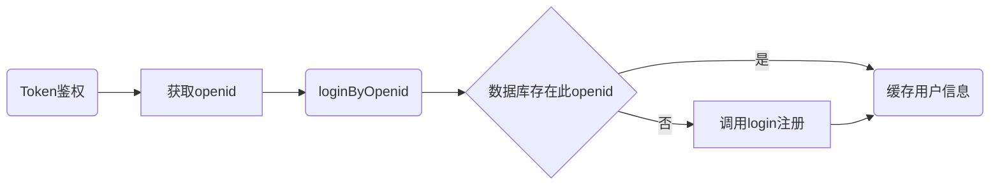

## user相关接口   
* [x] <a href='#login'>login</a>   
* [x] <a href='#getOpenid'>getOpenid</a>   
* [x] <a href='#loginByOpenid'>loginByOpenid</a>   
* [x] <a href='#logout'>logout</a>   
* [x] <a href='#get'>get</a>   
* [x] <a href='#update'>update</a>    


## 接口文档   
用户交互流程  

**注：用户的openid是所有操作的必须项**

用户数据：

| 变量名    | 类型   | 变量含义                            |
| --------- | ------ | :---------------------------------- |
| openid    | string | 前端获取的用户唯一标识              |
| nick_name | string | 用户昵称                            |
| avatar    | string | 用户头像(url)，一般是微信头像       |
| gender    | int    | 性别，0或1                          |
| phone     | string | 用户联系方式（不一定一定是手机号）  |
| ctime     | string | 数据创建时间（所有model共有的特性） |
| mtime     | string | 数据修改时间（所有model共有的特性） |

## Token鉴权

[Token账户鉴权系统][https://gogs.itoken.team/634308664/token-sso/src/master]

请前端同学先调用token账户鉴权系统，鉴权成功后再以流程验证登录。

如果鉴权成功，鉴权时用户输入的手机号可以直接作为login的phone参数进行注册，不需要再验证。



数据库是否存在openid这一过程是依靠返回值判断的。

所有正确操作的返回值都是0

### <a name='login'>login</a> 用户登录（无状态注册）

**如果没有数据库内用户的openid，则用login进行注册**

url = www.example.com/service/user/login   
method = post   
params:   

|   名称  | 类型 | 必须 | 备注 |
| ------| :---: | :----: | :----: |
|openid | string | 是 | 可通过云函数或getOpenid获取，是每个用户的唯一凭证 |
|gender | int| 是 | 1是男还是女由前端自己决定= = |
|phone | string| 是 | 手机号，必要时可以短信验证 |
|avatar | string| 是 | 头像url（微信头像） |
|nick_name | string | 是 | 用户微信名或用来显示的名字 |
|           |        |      |                                                   |

return:
```json
{
    "code": 0,
    "msg": "success",
    "data": {
        "openid": "xxxxxxxx",
        "ctime": "2020-03-26 11:34:29",
        "mtime": "2020-03-26 11:34:35",
        "nick_name": "张三",
        "avatar": "http://www.example/media/avatar/1_20200401184953.jpg",
        "gender": "1",
        "phone": "12312312312"
    }
}
```

错误码：

| code |           含义           |
| ---- | :----------------------: |
| -1   |      提交的参数非法      |
| -2   |     其他错误，详情见错误输出     |

### <a name='getOpenid'>getOpenid</a> 获取用户openid   
url = www.example.com/service/user/getOpenid   
method = post   
params:   

*不建议使用*

|   名称  | 类型 | 必须 | 备注 |
| :-----| :---: | :----: | :----: |
|js_code | string | 是 |  |

**建议使用云函数：   **
https://developers.weixin.qq.com/miniprogram/dev/wxcloud/guide/functions/userinfo.html

### <a name='loginByOpenid'>loginByOpenid</a> 通过openid登陆，获取个人信息  
url = www.example.com/service/user/loginByOpenid   
method = post   
params:   

|   名称  | 类型 | 必须 | 备注 |
| :-----| ----: | :----: | :----: |
|openid | string | 是 |  |

return:
```json
{
    "code": 0,
    "msg": "success",
    "data": {
        "openid": "xxxxxxxxxxxxxx",
        "ctime": "2020-03-26 11:34:29",
        "mtime": "2020-03-26 11:34:35",
        "nick_name": "张三",
        "avatar": "http://www.example.com/media/avatar/1_20200320184953.jpg",
        "gender": 1,
        "phone": "12312312312"
    }
}
```

错误码：

| code |                含义                 |
| ---- | :---------------------------------: |
| -1   |           提交的参数非法            |
| -2   | 不存在此用户，此时应该调用login方法 |


### <a name='get'>get</a> 获取用户详情   
url = www.example.com/service/user/get   
method = post   
params:   

|   名称  | 类型 | 必须 | 备注 |
| :-----| :---: | :----: | :----: |
|openid | int | 是 |  |

return:
```json
{
    "code": 0,
    "msg": "success",
    "data": {
        "openid": "xxxxxxxxxxxxxx",
        "ctime": "2020-03-26 11:34:29",
        "mtime": "2020-03-26 11:34:35",
        "nick_name": "张三",
        "avatar": "https://www.example.com/media/avatar/1_20200320184953.jpg",
        "gender": 1,
        "phone": "12312312312"
    }
}
```

错误码：

| code |                    含义                    |
| ---- | :----------------------------------------: |
| -1   |               提交的参数非法               |
| -2   | 返回了多组数据（一个openid对应了多个用户） |
| -3   |          其他错误，详情见错误输出          |
| -4   |                 用户不存在                 |


### <a name='update'>update</a> 更新用户信息   
url = www.example.com/service/user/update   
method = post   
params:   

|   名称  | 类型 | 必须 | 备注 |
| :-----| :---: | :----: | :----: |
|user_id | int | 是 |  |
|update | json(string) | 是 | 如果提交的是字符串格式的json程序会loads，但最好提交json格式 |

e.g.:   
update={"phone":"13333333333"}   

return:   
```json
{
    "code": 0,
    "msg": "success",
    "data": []
}
```

错误码：

| code |                含义                |
| ---- | :--------------------------------: |
| -1   |           提交的参数非法           |
| -2   |      其他错误，详情见错误输出      |
| -3   | update参数提交的不是有效的json格式 |
| -4   |            json处理错误            |